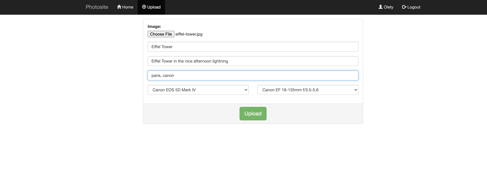
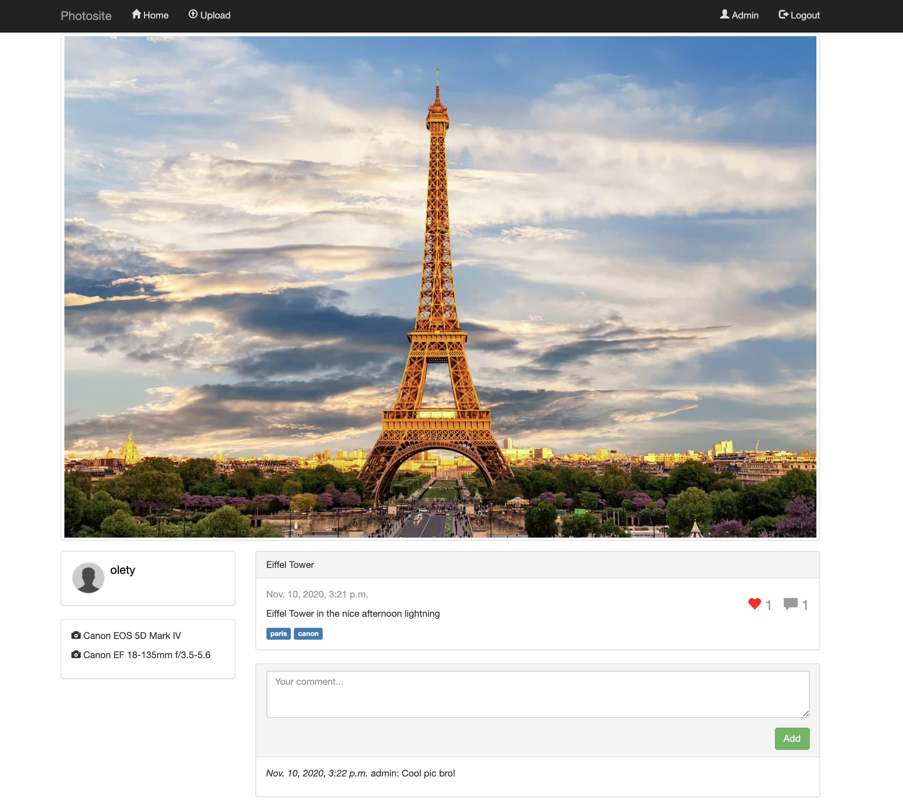

# Photosite

## What and why

This is a project developed for the course "Client-Server Architecture" in Wrocław University of Science and Technology.

Our goal was to create an application that showcased the interaction between the user (client) and a server.

We chose to re-create something like [500px](https://500px.com/) or [flickr](https://www.flickr.com/), a place where people can share their pictures with the world. In this case the users can upload pictures to the server, like/comment on them and add tags.

The app was developed using Python and Django. The database used in the repository is PostgreSQL but you can change it to SQLite3 or any other Django-supported DB. The front-end was styled with Bootstrap 3.

## The Team

- Oleksii Kyrylchuk
- Tsvetan Ovedenski

## Screenshots

 
Uploading a picture to the site. The field names are inside the textboxes before the user fills them out.

 
The photo feed

 
An example post - notice the description, tags, comments, likes and the camera gear specification

